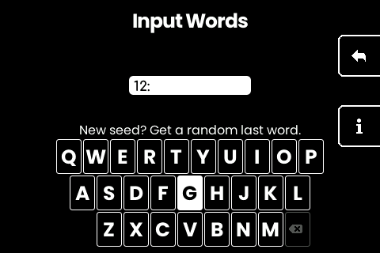
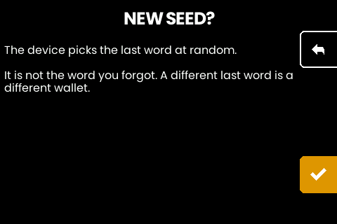
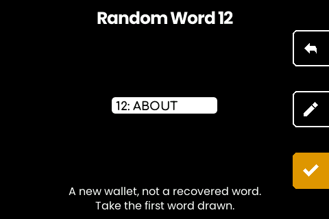
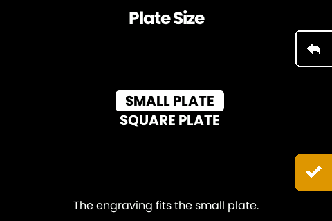
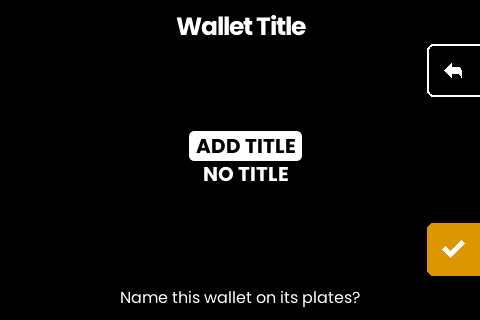
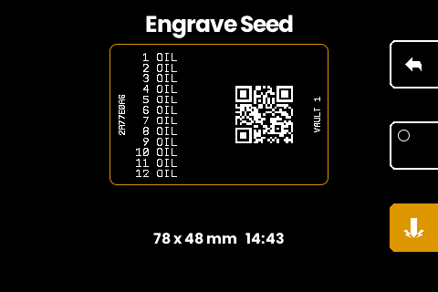
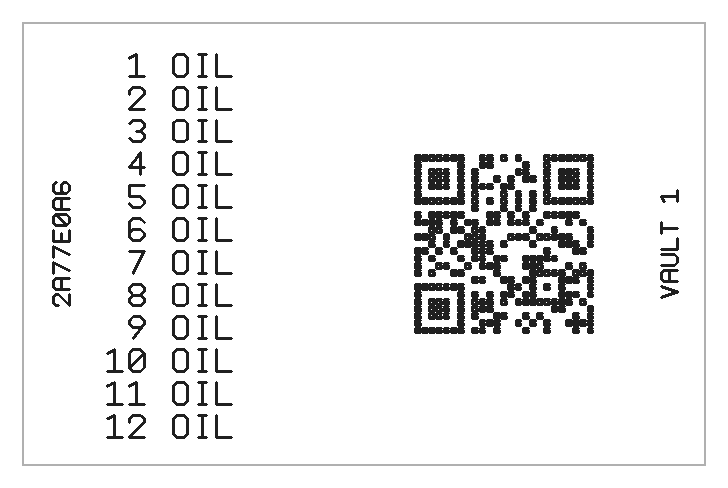
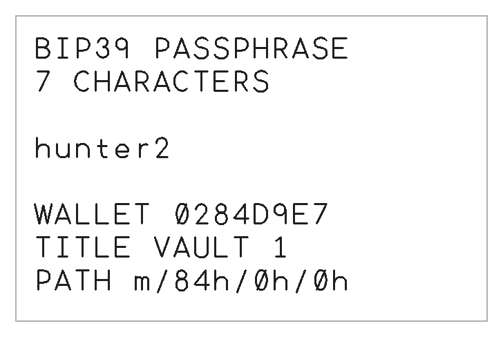

# Complete a hand-drawn seed phrase on the machine

Draw your own words by hand, type them in, and let the machine compute the
last one: the checksum word is the only part it generates. No computer, no
phone, no second signing device.

## Why the last word is different

The final word carries a checksum over all the others, so it cannot be drawn
like the rest: of the 2048 words, only **128** complete a 12-word phrase and
only **8** complete a 24-word one. Draw that word yourself and the phrase is
almost certainly invalid.

Computing it is arithmetic over the words you already have, not a secret.

## Where the words come from

[SeedSticks](https://seedsticks.org/) is the recommended source: a bag of 1024
double-sided sticks carrying the whole BIP39 list, two words per stick, drawn
by hand. It is worth using because the randomness is a physical process you can
watch from start to finish, with nothing to trust and nothing to verify
afterwards.

[SeedPills](https://github.com/SeedSigner/SeedPills) is the same thing printed
at home: a script generates a model for OpenSCAD, and a full set is likewise
1024 two-sided pieces. Dice against a printed conversion table work too, and so
do coin flips, at eleven flips per word.

Because a piece carries two words, drawing one is two decisions and only the
first is made in the bag. **Take the face that lands up.** Do not turn it over
and keep the word you prefer. The piece is worth 10 bits and the face is worth
the eleventh, so choosing the face yourself throws away a bit per word: 230
across 23 draws instead of 253. Still far beyond anyone's reach, and still free
not to lose. Neither project spells this out, so it is on you.

Draw **11 words** for a 12-word phrase, or **23** for a 24-word one. How you
draw them is the next section, and it is the part that matters.

## The draw is the whole secret

Everything else in this document is housekeeping. The security of the phrase is
decided in the seconds you spend with your hand in the bag, and nothing
downstream can add to it or repair it.

**Mix before every draw, not once at the start.** Tiles you handled recently sit
where you left them. A bag stirred once and then dipped into twenty-three times
produces draws that are related to each other, which is exactly what you are
trying to avoid.

**Draw blind.** No looking into the bag. No feeling around for a shape or an
edge, no sorting through to the bottom, no taking one from the middle because
the top ones "were just in there". Close your fingers on the first tile they
touch and pull it out.

**Never reject a draw.** Not because the word repeats, not because you dislike
it, not because it feels wrong for a wallet. Rejecting a tile is choosing, and
choosing is the one thing that actually destroys this.

Repeats are normal, not a signal: draw 23 words and there is about a **12%**
chance at least one appears twice (2.7% for 11 words). A phrase with a repeat is
as strong as any other.

**Put the tile back.** This one is worth being honest about: skipping it costs
you 0.36 bits out of 253, so it is not what will hurt you. Follow it anyway,
because it keeps every draw identical to every other and it removes the excuse
to re-draw a word you have already seen.

### How much margin you have

A clean blind draw is 11 bits per word, 253 bits across 23 words. Mechanical
imperfection (a bag not stirred quite enough, tiles worn unevenly) shaves some
of that off, and the margin is enormous: even losing *half* your entropy leaves
126 bits, which nobody is searching.

What has no margin is substituting choice for chance. Words you picked, or
draws you filtered, do not come from 2048 possibilities each; they come from
whatever your mind offers up, which is a small set an attacker can grind through
directly. That failure does not shave bits off the total, it moves the phrase
into a searchable space no matter how many words it has.

So: imperfect mixing is survivable. Deciding anything is not.

### Then check what you typed

The keyboard cannot accept a word that does not exist, so typos and half-words
are not a risk. What it cannot know is *which* word you drew. Enter ADDRESS where
your tile says ADDICT, or two words out of order, and you get a valid phrase for
a different wallet. Restoring would almost always catch that; generating cannot,
because the checksum is computed from what you entered. Read the list
against your tiles before confirming; order counts as much as spelling.

Draw somewhere unobserved, and put the tiles away before anyone comes in. Write
down the machine's word alongside your own. After engraving, read the plate back
against the screen, then destroy the paper.

## On the machine

1. The start screen reads **Backup Wallet**. Press the checkmark, then choose
   **12 WORDS** or **24 WORDS** under *Choose number of words*.
2. Type your drawn words in order. Letters that cannot lead to a word go dim,
   and once the letters resolve to exactly one word a checkmark appears; press
   it to accept the word and move to the next.
3. On the final word, with nothing typed, the screen offers a random last word.
   Take the middle button. Typing a word instead hides the offer; clearing the
   box brings it back.

   

4. An explanation appears before anything is drawn. The bottom button goes
   ahead, the top button backs out.

   

5. The machine draws a word and shows it. The bottom button accepts, the top
   button backs out, and the middle button draws a different one.

   

   **Take the first word.** The middle button is there for a genuine misdraw,
   not for shopping. Rejecting words until one looks right is the same mistake
   as putting a tile back because you dislike it, and it costs you the
   machine's contribution: 3 bits of 256 on a 24-word phrase, 7 of 128 on a
   12-word one. Your own 253 (or 121) are untouched either way, so this is a
   small loss rather than a disaster. It is still a loss, and it is free to
   avoid.
6. Check every word against your draw, then confirm to engrave.

What follows is up to three plates in a row: the seed, then the wallet
descriptor, then the passphrase if you set one. Each is offered and each can be
skipped, so a seed already on metal can be entered just to produce a descriptor
plate, and a descriptor can be cut again years later without touching the seed.

Two plate formats exist: the square 85 x 85 mm plate and the small 85 x 55 mm
one. Whenever a plate fits the small format (a 12-word seed does, a 24-word
seed does not) the machine asks which to cut, small first. Content that only
fits the square plate never sees the question. The small plate sits in the
machine's clamp on a printable adapter jaw:
[hardware/small-plate-jaw](../hardware/small-plate-jaw/).



## Add a passphrase, or don't

Before the seed plate engraves, the machine asks whether to add a passphrase.
Say no and nothing changes. Say yes and you type one on an ASCII keyboard: the
arrow key cycles between lower case, upper case and symbols, while the digits
and the space bar stay put across all three. Every printable ASCII character is
reachable, so a spaced passphrase is entered exactly as written.

**A passphrase has no checksum.** One wrong character opens a different wallet,
which is perfectly valid and completely empty, and nothing downstream can warn
you. So the machine shows it back exactly as typed, beside the fingerprint of
the wallet it opens, and makes you hold to confirm. Read it character for
character. If you already know your wallet's fingerprint, that is the stronger
of the two checks.

Only printable ASCII can be typed. BIP39 salts with the NFKD normalisation of
the passphrase and the machine does not normalise, because normalising ASCII
changes nothing. A passphrase containing anything else cannot be entered here,
and that wallet cannot be opened on this machine.

**There is no length limit.** BIP39 sets none, so neither does the machine. Type
as long a passphrase as you like; the box shows the tail of what you are typing
and the confirm screen scrolls through all of it. The one thing length costs you
is portability, and it is worth knowing before you commit: Trezor stops at 50
characters, Ledger, Coldcard and Jade at 100, BitBox02 at 127, Keystone at 128.
A passphrase longer than that is a wallet those devices cannot open, whatever
you do with the seed words.

From here on, the fingerprint on every plate is the wallet you actually end up
with, passphrase included. That is what makes the plates identifiable as a set.

## Name the wallet, or don't

After the passphrase question the machine offers a wallet title: up to 18
characters, engraved on every plate of the set: the seed plate in the spot
the layout has always reserved for it, the descriptor plate above the
descriptor, the passphrase plate on a TITLE line. Steel uppercases it. Skip
it and the plates look exactly as they always have; name it and a drawer of
plates sorts into wallets by eye years later. Like the passphrase, the title
is asked once and carried through every retry, so backing out of a plate
never means retyping it.



On a titled small plate the name reads up the right edge, mirroring the
fingerprint on the left:



The finished plate, rendered from the same planned strokes the machine
cuts:



## Set up the watch-only wallet

Once the seed plate is done, the machine offers the wallet descriptor: choose an
address type, or take **SKIP** at the bottom of the list.

Segwit (`wpkh`, m/84'/0'/0') is understood by every wallet in circulation.
Taproot (`tr`, m/86'/0'/0') is newer, with better privacy and fees, and slightly
narrower support. Nested segwit (m/49') and legacy (m/44') are offered too, for
a seed destined for a system that only speaks an older standard. All four derive
from the same seed, so choosing one now does not rule out the others later.

Each type carries its standard path, which is the whole answer for a wallet you
are creating here. **ADVANCED** is for one that already exists somewhere else: it
lets you pick the address type and then edit the derivation path, prefilled with
the standard one, for a wallet set up at a second account or a different depth.
Check the path and fingerprint on screen against that wallet; the machine has no
way to check them for you.

The descriptor appears as a QR code with its type, master fingerprint and
derivation path beside it. Scan the code into a wallet on your phone or desktop
and you have a watch-only wallet: it can show balances, generate receive
addresses and build transactions, but it cannot spend, because the seed never
left the machine. Check the fingerprint on screen against what the wallet
reports after import; they must match.

The bottom button takes you on to engraving the descriptor as a plate of its
own, which is worth doing for a wallet you intend to keep. Restoring from a seed
is easier when you also know which address type it was set up with.

This descriptor is also the standard form for joining a multisig as an
xpub-only cosigner: delivered to another machine as a text record, the
[wallet builder](howto-multisig-wallet.md) takes its key without the
seed ever moving.

**A descriptor is a privacy secret.** It cannot move funds. It does reveal every
address the wallet will ever use, so anyone holding it can see your whole
balance and transaction history forever. Guard it as private information, and
know it is not a key.

## The passphrase plate

If you set a passphrase, the machine then offers to engrave it on a plate of its
own, the third of the set:

```
BIP39 PASSPHRASE
7 CHARACTERS

hunter2

WALLET CA2C62D2
PATH m/84h/0h/0h
```

A named wallet adds a TITLE line between WALLET and PATH; an untitled
set's plate reads exactly as above. The titled plate as engraved:



The passphrase sits alone between blank lines, so where it begins and ends is
never in question. Above it is the **character count**, the only
check the passphrase carries on its own. It matters most for a long one: if the
passphrase wraps onto a second line and the break swallowed a space, the number
of characters you transcribe will not match the number on the plate.

Short passphrases engrave at the largest size the machine has; longer ones step
down the same ladder as any other text plate. That ladder has a bottom: around
880 characters alongside a standard derivation path, fewer with a long one.
Past it the machine says the text does not fit and declines the plate. The
wallet is unaffected and the seed plate is already cut, so a passphrase that
long has to be recorded some other way. A passphrase plate that fits the
small 85 x 55 mm plate (up to 704 characters of text) offers the plate
choice before engraving, like any other text plate.

**This plate is exactly as sensitive as the seed plate.** The two together are
the whole wallet. Storing them in the same place converts a passphrase back into
no passphrase at all, and the point of the third plate is that it lives
somewhere the first one does not.

## What the machine's randomness is worth

Honestly: very little, and that is the point.

In a 24-word phrase your 23 drawn words fix **253 bits**. The machine
contributes **3**, for 256 in total. In a 12-word phrase it is 121 from you and
7 from the machine, for 128.

Now suppose the machine's generator is bad: biased, broken, or backdoored. The
worst case is that its 3 bits are fully predictable, which leaves an attacker
facing your 253. Nobody brute-forces 253 bits. The randomness of the last word
is close to irrelevant to the strength of your seed.

That is the whole argument for generating a phrase this way. **The machine
chooses three bits of your secret and cannot influence the other 253.** It
still handles all 256: you type them in, it holds them in memory, renders them
and cuts them into steel. What the split removes is trust in its *generator*,
not trust in the machine. A device
that generates all 24 words holds your entire wallet inside its random number
generator, and a flaw there is total and undetectable. Here the blast radius is
three bits, whatever the hardware does.

For what it is worth, those bits come from the RP2350's hardware generator,
which conditions and health-checks its own output in silicon; if the checks
fail, the machine reports it and draws nothing rather than falling back on
something weaker. That is a reasonable design, but the reason you can relax
about it is the arithmetic above, not the datasheet.

The same arithmetic cuts the other way, and this is the real risk: **the machine
cannot rescue a bad draw.** Eleven words chosen because they were memorable, or
drawn from a bag you did not mix, produce a weak seed no matter what the machine
adds to the end of it. Every bit of security in the phrase is a bit you
produced.
