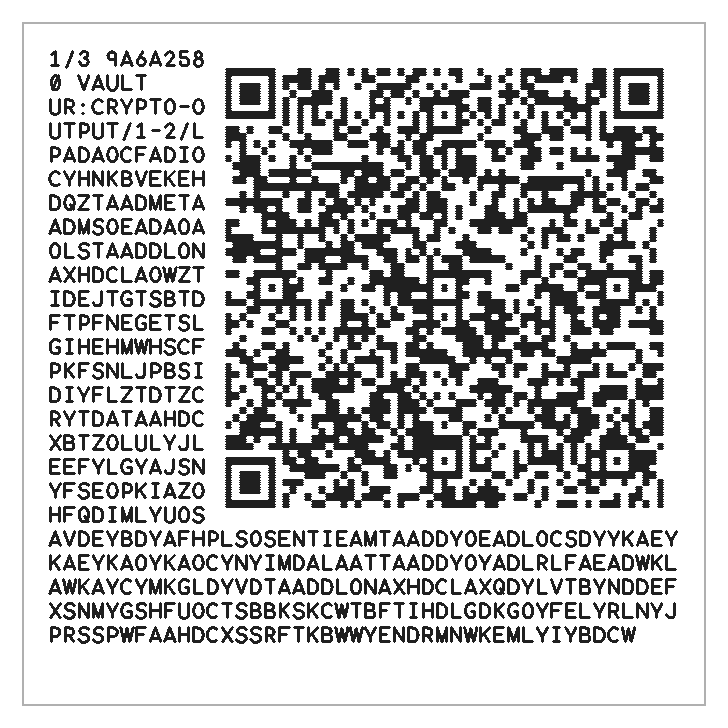
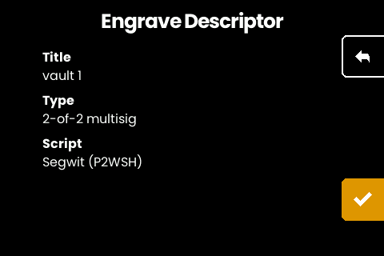
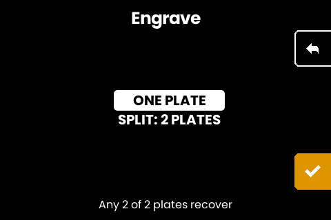

# Split a multisig descriptor across its cosigner plates

Scan a multisig setup and the machine offers to cut one plate per cosigner
instead of a single descriptor plate. Any signing quorum of those plates
recovers the full descriptor: for a 2-of-3, any two plates. This restores the
original SeedHammer's partitioning scheme on SeedHammer II hardware, so a
cosigner who holds enough seed plates to spend also holds enough steel to
reconstruct the wallet, with no descriptor plate as a separate single point
of loss.

The shares carry the wallet's public structure: xpubs, threshold, derivation
paths. No seed material. Losing one to a stranger costs privacy, not funds.

## What you need

- A SeedHammer II running the [fork firmware](../README.md#firmware-downloads).
- The multisig setup, delivered over NFC: tap a Coldcard's export directly,
  or write the descriptor string as a text record with
  [`write-nfc.py --raw`](../cmd/textplate/write-nfc.py) or from
  [Studio](https://gangleri42.github.io/studio/). A wallet
  [built on the machine itself](howto-multisig-wallet.md) arrives at the
  same split screens without scanning anything.
- One blank plate per cosigner, plus spares for extra copies. Engraving the
  share on the back of each cosigner's seed plate works and keeps the pair
  physically inseparable.

## Supported quorums

The partition needs an exact scheme per quorum shape. Where one exists, every
plate carries a fragment smaller than the whole; where none does, the machine
falls back to one complete descriptor plate per cosigner.

| quorum                        | plates carry            | recover from        |
|-------------------------------|-------------------------|---------------------|
| n-1 of n (2-of-3, 3-of-4, 4-of-5, ...) | one fragment each | any n-1 plates      |
| n of n (2-of-2, 3-of-3, ...)  | one fragment each       | all n plates        |
| 2-of-4                        | two fragments each      | any 2 plates        |
| 3-of-5                        | two fragments each      | any 3 plates        |
| everything else (1-of-n, 5-of-7, ...) | a full copy each  | any single plate    |

Why these shapes and no others: a fragment can only be a slice of the
descriptor or the XOR of slices, because that is all the standard UR decoder
in wallets can undo, and scanning into an unmodified wallet is the point.
"Any m plates" means every possible m-sized subset of plates must solve to
the full descriptor from one fixed assignment, and a plate has room for at
most two fragments. Inside those three constraints, exact designs are known
for the shapes in the table and no others. A 5-of-7 would need all 21 of its
possible 5-plate subsets to solve simultaneously; no two-fragment assignment
does it.

The rest get the one design that always works: the full descriptor on every
plate, engraved as the plain descriptor plate rather than the UR envelope
(same content, and the envelope would inflate it by half again). Every plate
then recovers alone, but each plate is as large as the descriptor itself.
For 1-of-n this is no compromise at all; the full copy is the optimal
1-of-n split.

Fragments are cleartext slices (one 2-of-3 plate shows half the descriptor's
bytes): the split is loss protection, not secrecy, and the privacy note
above applies to every share plate equally.

A share plate as engraved, the pairing header and the UR text wrapped
around its code:

## On the machine

1. **Scan.** Hold the tag or phone against the reader while the start screen
   shows. The descriptor screen lists the wallet title, quorum, and script
   type; check them against your setup and press the checkmark.

   

2. **Choose the split.** A multisig offers ONE PLATE (the single descriptor
   plate, exactly as before) and SPLIT: N PLATES. The lead line states the
   recovery rule, e.g. "Any 2 of 3 plates recover". Quorums without a scheme
   offer N FULL COPIES instead; pick the plate variant (TEXT + QR / TEXT
   ONLY / QR ONLY) as usual and the set engraves that plate N times.

   
   On the ONE PLATE path the machine also asks for the plate size when the
   descriptor fits the small 85 x 55 mm format (which sits in the clamp on
   the printable [jaw](../hardware/small-plate-jaw/)); the variant list is
   then the small plate's own, so TEXT + QR may drop away. Splits and full copies
   stay on the square plate.
3. **Per plate.** Each plate opens on a gate titled "Plate k of N" with the
   cosigner fingerprint it belongs to. ENGRAVE PLATE plans the layout and
   hands over to the engrave screen, which shows the share as it will be
   cut (the header, the wrapped text and the code) with its dimensions and
   duration. Insert the blank (or the cosigner's seed plate, back side up),
   close the lock, hold the button. SKIP passes over a plate, which is how an
   aborted set resumes: rescan, split again, and skip the plates you already
   cut.
4. **Copies.** After each finished plate: NEXT PLATE (or DONE on the last)
   moves on, ANOTHER COPY routes back through the gate to cut the same share
   again. Copies of the same plate are identical and interchangeable.

All plates of a set engrave at one matched text size and QR scale, chosen so
the largest share fits.

Share plates carry no secrets, so the middle button's hide toggle matters
less here than on a seed plate; it is there on every plate for the times you
would rather the room did not read the screen.

## Keep the pairing straight

**Share k belongs to cosigner k.** The header on every plate names its plate
number and cosigner fingerprint; keep each share with that cosigner's seed
plate. Recovery needs a quorum of *different* shares: two copies of the same
share count once, so a swapped pair of plates can turn a valid quorum of
cosigners into an insufficient set of steel. The full-copy fallback has no
such rule; those plates are all the same.

## Recover into a wallet

Point a wallet's QR scanner at the plates, one after another, any order:

- **Sparrow.** New Wallet, import the descriptor by camera, and scan each
  plate's code in turn. The codes are parts of one animated UR; the progress
  bar completes when a quorum has been seen and the multisig loads with all
  cosigners.
- Any wallet that scans multi-part `ur:crypto-output` codes (Nunchuk,
  BlueWallet, Keystone-style importers) behaves the same.

The engraved text under each code is the same UR payload, character for
character. A camera-less recovery types those lines into any BC-UR decoder;
tedious, but the plates never depend on a camera surviving.

Fragments carry checksums, so a misread or damaged code fails loudly rather
than loading a wrong descriptor.

## Fine print

- The partition is fixed at engraving time and pinned by tests in this repo:
  plates cut today remain decodable by tomorrow's firmware.
- Share codes engrave at level L error correction and the set's one QR scale,
  like the single descriptor plate.
- The single-plate flow is unchanged and remains the right choice when one
  plate in a safe place serves the whole quorum.
