# Build a multisig wallet on the machine

The machine assembles an M-of-N segwit multisig without a computer in the
middle: every cosigner seed can be drawn by hand and typed here, tapped in
over NFC, or represented by a bare account key from a signer that never
shows this machine its seed. The wallet leaves by camera as an animated
QR, both ends compare the first address before anything is cut, and the
plates come last: each entrusted seed's own plates, then the descriptor
as one plate, the cosigner split, or full copies.

## What this makes

A `wsh(sortedmulti(M, …))` wallet at the standard multisig derivation
path, `m/48h/0h/0h/2h` for every cosigner. M and N are yours to pick, two
to seven cosigners, any threshold. Sparrow, Nunchuk, BlueWallet and every
other descriptor wallet in circulation understands the export; taproot
multisig is deliberately absent until coordinators settle on one.

## What you need

- A SeedHammer II running the [fork firmware](../README.md#firmware-downloads).
- A way to draw words for each seed created here:
  [SeedSticks](https://seedsticks.org/), dice against a conversion table,
  or coins. **Read [the seed how-to](howto-generate-a-seed.md) first**; its
  drawing rules are the whole security of every seed, and nothing in this
  flow repairs a bad draw.
- For cosigners arriving over NFC: the seed words as a text record, or
  the cosigner's account key, ideally as the single-sig descriptor
  their signer exports for the seed (a key expression with origin,
  `[fingerprint/path]xpub.../<0;1>/*`, is also accepted).
- A coordinator with a camera for the watch-only wallet. The steps below
  say Sparrow; any wallet that scans animated `ur:crypto-output` behaves
  the same.
- Blank plates: one per entrusted seed, one per passphrase you set, plus
  the descriptor's own plates (one, or one per cosigner for the split).
  Any plate cut in the small 85 x 55 mm format needs the printable
  [jaw](../hardware/small-plate-jaw/) in the clamp.

## On the machine

Every screen below is the firmware's own rendering at the device's
resolution, regenerated from the demo seeds whenever the interface
changes.

1. From the start screen press the checkmark, then choose **MULTISIG
   WALLET** under *Choose what to enter*.

   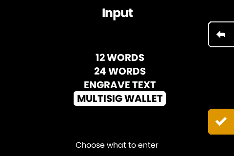

2. **Name the wallet.** The title engraves on every plate of the set, up
   to 18 characters, uppercased on steel. It is how a drawer of plates
   sorts into wallets years later. This one is not optional: an unnamed
   set is the thing that gets mixed up.

   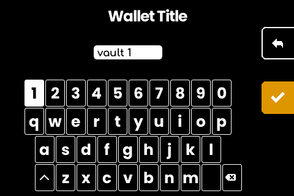

3. **Pick the quorum.** How many keys share the wallet, then how many must
   sign to spend. The lists open on 3 and on 2: change them if your setup
   differs.

   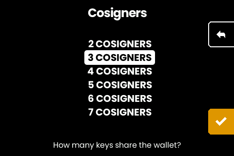
   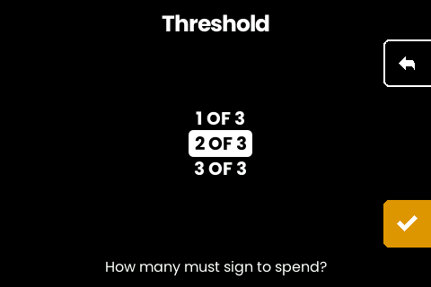

4. **Add each cosigner**, one at a time, from one page. Every cosigner
   lands here, and the reader is already listening:

   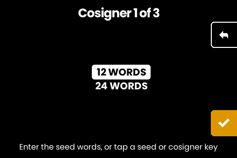

   - **Type a drawn seed**: pick 12 or 24 words and the keyboard opens,
     with the machine offering its checksum word on the last position
     exactly as the single-seed flow does.
   - **Tap a seed**: hold the tag to the reader, no menu first. The
     words land on the same review screen typing ends on.
   - **Tap an account key**: how a hardware-wallet cosigner joins. The
     form to standardize on is the single-sig descriptor, the 1-of-1 a
     signer produces when it exports a seed's wallet descriptor: it is
     checksummed, it carries the key origin and the receive and change
     branches, and it is exactly what this machine itself shows and
     engraves for a single-sig wallet. A Coldcard exports one for a
     seed; so does the descriptor screen here. The machine takes its
     one key, at whatever path the export named. A bare key expression
     (`[fingerprint/path]xpub…`, a Coldcard's multisig xpub export)
     works too, as long as the origin rides in front of the xpub; a
     naked xpub without it is refused, and the screen says why. No
     seed material touches this machine; that cosigner keeps their own
     backup, and gets no seed plate here.

   A tap of anything else (a text plate, a multisig descriptor) shows
   "Not a seed or cosigner key" on the page and keeps listening. A
   tapped account key's confirm reads "Public key only": the walk's
   third cosigner could have joined exactly like this, same
   fingerprint, no seed:

   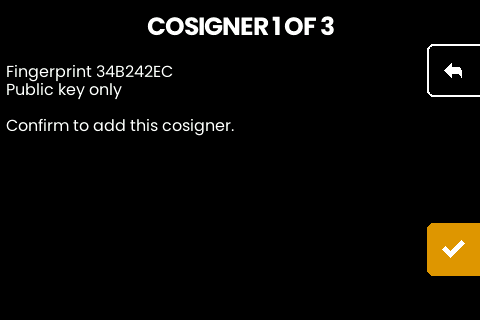

   Every seed passes the same review screen and checksum gate as a single
   seed: read the words back against your tiles before confirming. Then
   the passphrase question, per seed, behind a warning worth taking
   seriously (below). The machine shows each cosigner's fingerprint before
   it counts, and it refuses a key whose master fingerprint is already in
   the wallet: that is the same seed twice, not a coincidence.

   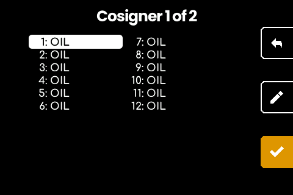
   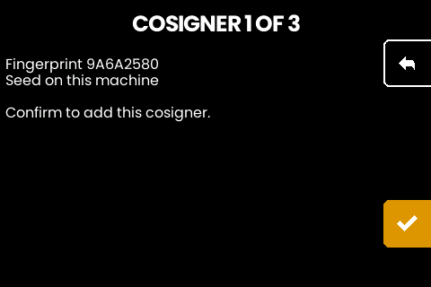

5. **Review and hold.** The title, the quorum and every fingerprint on one
   screen. Hold the button and the wallet exists.

   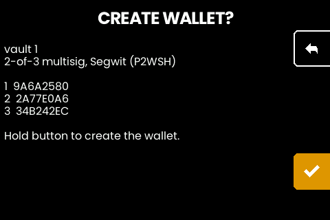

6. **Scan the export.** The descriptor plays as an animated code. In
   Sparrow: New Wallet, import by camera, hold the phone or webcam to the
   screen until the progress bar completes. One code stands still when the
   descriptor is small enough; larger wallets cycle a few parts and the
   scanner assembles them in any order.

   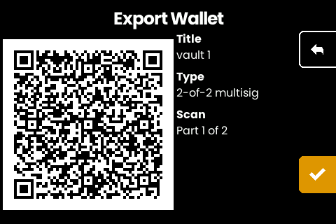

7. **Compare the first address.** The machine derives the wallet's first
   receive address and shows it; the coordinator, fed only the QR, must
   show exactly the same one. Read it group by group; the spaces on
   screen are not part of the address. If they differ, stop: something
   went in wrong, and it cost you minutes instead of steel.

   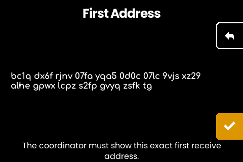

8. **Cut the plates.** Each entrusted seed offers its seed plate (titled,
   with the cosigner's fingerprint on the gate) and, if set, its
   passphrase plate.

   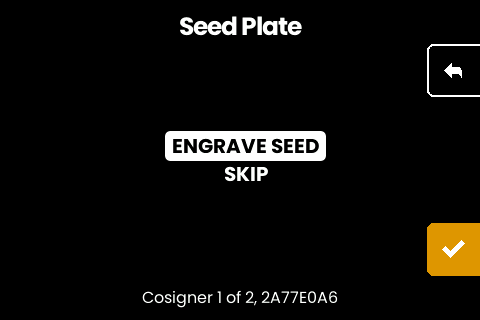

   Then the descriptor, through the machinery every scanned multisig
   runs. The choice screen offers both endings:

   

   **ONE PLATE** cuts the complete descriptor onto a single plate: pick
   the variant (TEXT + QR holds both recovery paths) and the engrave
   screen shows the plate before anything moves.

   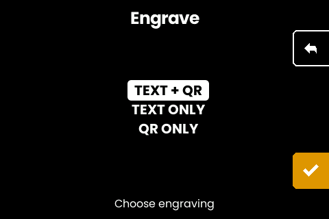
   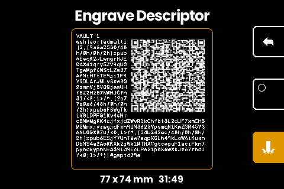

   **SPLIT: N PLATES** cuts one share per cosigner instead: no plate
   carries the whole descriptor, and any 2 of this wallet's 3 share
   plates rebuild it, so there is no descriptor plate to lose as a
   single point of failure. Each share pairs with its cosigner's seed
   plate by fingerprint (the back of the seed plate is the natural
   spot), exactly as [the split how-to](howto-multisig-plates.md)
   describes. Each plate opens on its pairing gate and previews its
   share before the cut:

   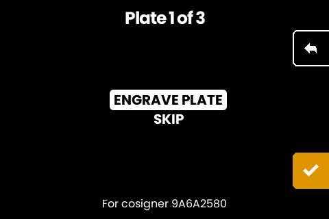
   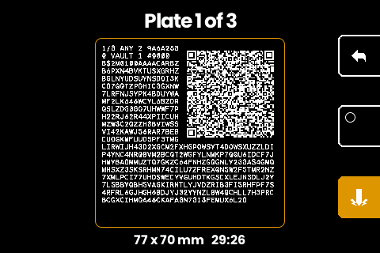

   Both endings as engraved, rendered from the same planned strokes
   the machine cuts. The complete descriptor on its single plate, title
   above the text:

   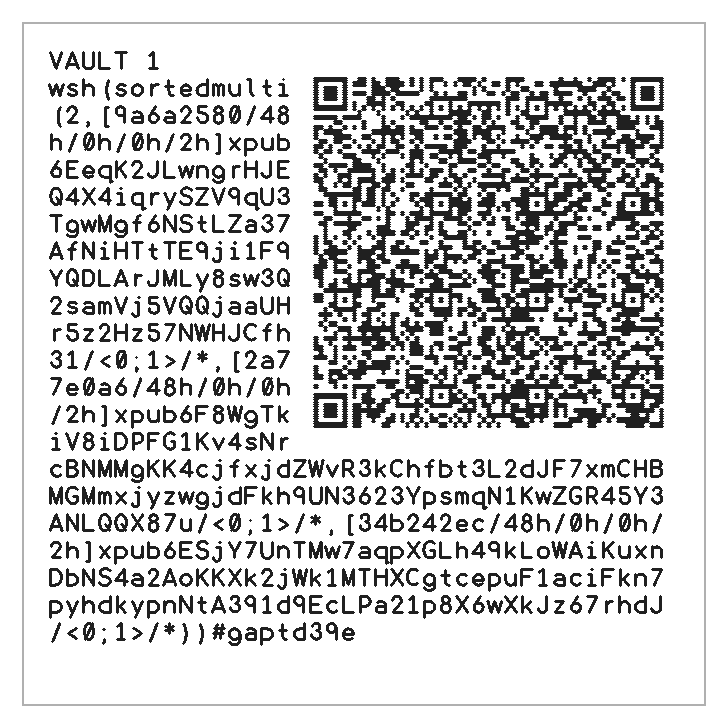

   And cosigner 1's share of the split, the pairing header over the
   share's code; two more like it complete the set:

   

## Passphrases multiply

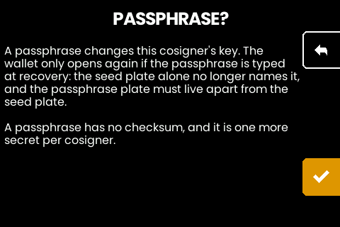

The machine asks the passphrase question for every seed it holds, behind
a warning the single-seed flow does not need. A passphrase changes that
cosigner's key: the wallet only opens again if the passphrase is typed at
recovery, the seed plate alone no longer names the wallet it belongs to,
and the passphrase plate has to live apart from its seed plate to mean
anything. One passphrase is a decision; N of them are N extra secrets
with no checksum, and the person most likely to stack them is the one
setting up every cosigner in one sitting. Answer NO unless you know
exactly which threat the passphrase answers.

## Recovery, and what resumes

The wallet recovers from any M of the N seeds plus the descriptor,
which is what the plate set holds in steel. The seed plates restore into
any BIP39 signer; the descriptor restores from the split plates' codes
through the machine or a computer
([how](howto-multisig-plates.md#recover-into-a-wallet)), a single
descriptor plate, or the coordinator's own backup.

An aborted plate session is re-cut, not resumed: scan the descriptor
back in (from a plate QR, the coordinator, or a text record), split
again, and engrave the whole set. Each split draws fresh randomness, so
plates of different sessions never combine; the session tag in the
header tells the sets apart, and partial plates of an earlier tag are
scrap. One nuance: the descriptor string itself carries no title, so a
rescan from raw text produces share headers without the wallet name;
scanning the coordinator's export with the name attached (or a
`{label, descriptor}` record) keeps the headers matching.

Seeds live only inside one run of the flow. Backing out discards them
after a held warning, and finished or abandoned, the machine forgets the
words; there is no session to come back to, deliberately.
