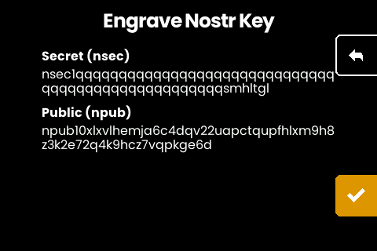
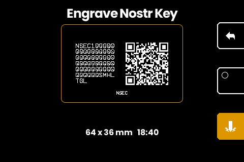
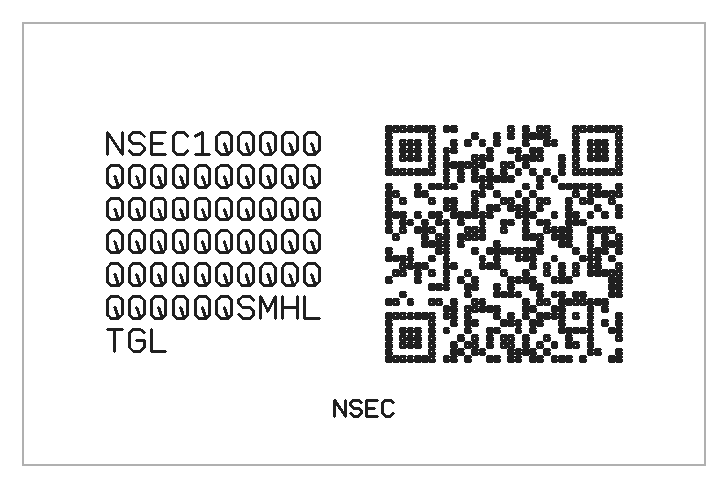
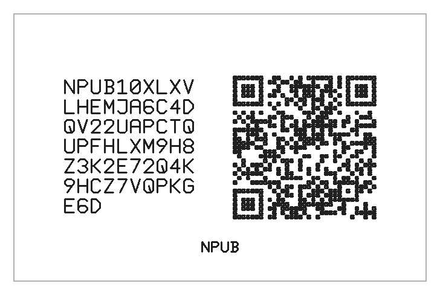

# Engrave a Nostr key plate

The fork recognizes NIP-19 keys. Write an `npub1...` or `nsec1...` string to
the machine as a plain NFC Text record (from a phone app, or
`write-nfc.py --raw` with the [text-plate CLI setup](howto-text-plates.md))
and it offers a key plate. For a key held as a PEM,
`sh2key nsec <key.pem> -nfc` derives and sends the nsec directly; the
tradeoffs of reusing the boot key as a Nostr identity are named in
[the backup how-to](howto-bootkey-backup.md).

## What is accepted

Simple keys only: `npub` and `nsec`, uniformly lower or upper case (mixed case
is invalid bech32 per BIP-173).

## The flow

For an npub, the machine shows the key for confirmation and engraves a single
NPUB plate.

For an nsec, the machine derives the public key first and shows both. It
engraves the NSEC plate, then offers a second engraving for the derived NPUB,
so one tap yields the pair. Decline the second plate if you only want the
secret on metal.

The figures here use the secret key 1, all `q`s in bech32: a key that is
synthetic on sight, in the spirit of the demo seeds elsewhere in these
manuals.

Key plates render in the same fixed-width font as seed plates. They fit the
small 85 x 55 mm plate (held in the clamp by the printable
[jaw](../hardware/small-plate-jaw/)), so the machine asks which plate to cut before each
engraving. The engrave screen holds the planned plate, key text beside its
QR code, until you hold the button:

The pair as engraved, rendered from the same planned strokes the machine
cuts:

## Handle with care

An NSEC plate is the private key, readable by anyone who sees it. Engrave it
with the same discipline as a seed phrase: alone, and store the plate as you
would a seed plate.
