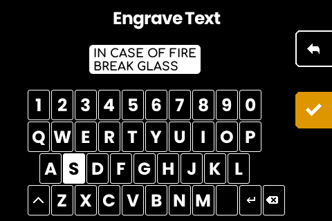
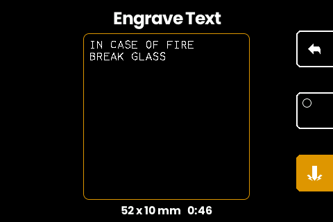
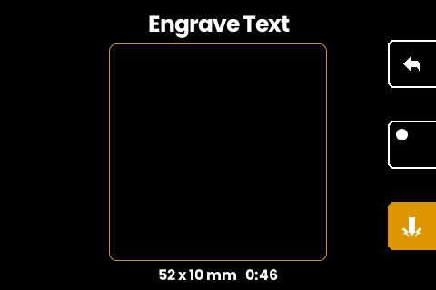
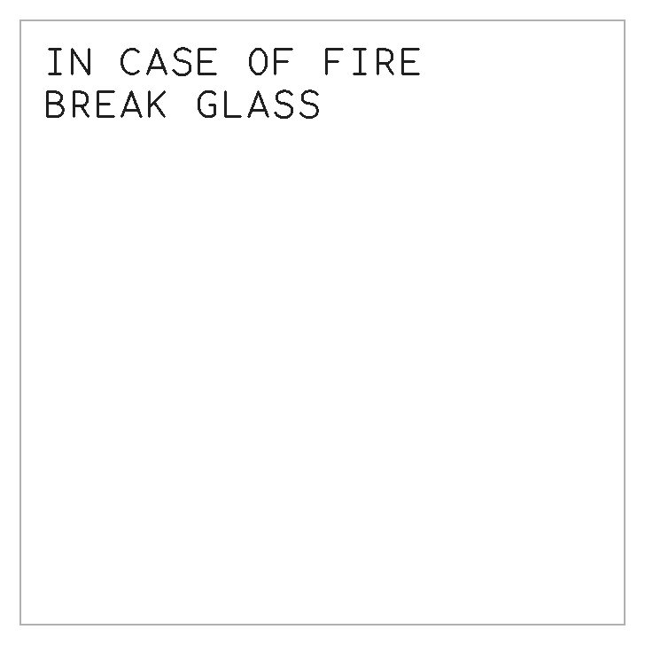

# Engrave a free-form text plate

Write a plain NFC Text record to the machine and it engraves the text as a
plate: one record line per plate line, set at the largest size that fits. No
app pairing, no cable, no file format. Or skip the tag entirely and type the
text on the machine itself. This is a fork feature; upstream firmware rejects
anything that is not a descriptor, seed phrase, or codex32 share. (use NFC
Tools APP, add text --> send, done. preview renders on screen)

## What you need

- A SeedHammer II running the [fork firmware](../README.md#firmware-downloads).
- Something that writes NFC Text records: a phone app (NFC Tools works),
  [Studio's plate composer](https://gangleri42.github.io/studio/textplate/),
  or [`write-nfc.py`](../cmd/textplate/write-nfc.py) with a USB NFC reader
  (an [ACR122U](../README.md#host-setup)).
  Typing on the device needs none of these.

## Compose

The plate font covers the 95 printable ASCII characters. The grid depends on
the text size, and the firmware picks the largest size whose grid holds your
composition:

| size (mm) | square (cols x rows) | small (cols x rows) |
|-----------|----------------------|---------------------|
| 6.0       | 22 x 13              | 22 x 8              |
| 5.0       | 26 x 15              | 26 x 9              |
| 4.4       | 30 x 17              | 30 x 11             |
| 3.8       | 34 x 20              | 34 x 12             |
| 3.4       | 38 x 23              | 38 x 14             |
| 3.0       | 44 x 26              | 44 x 16             |

Every plate shares the same width, so columns match across formats; the
85 x 55 mm small plate only has fewer rows. When a composition fits the
small grid the machine asks which plate to cut (the small plate needs the
printable [jaw](../hardware/small-plate-jaw/) in the clamp); the biggest small-plate
text is 704 characters (44 x 16 at 3.0 mm) against 1144 on the square.

Two rules worth knowing:

- **Lines you size deliberately stay put.** A line that fits some grid
  unwrapped pins the fit to that size or smaller; a longer line then wraps
  instead of quietly reflowing your whole layout into a smaller font. Fill a
  26-column line and the plate engraves at 5.0 mm or below, whatever else the
  text does.
- **Whitespace is canonicalized.** CRLF becomes LF, trailing spaces are
  stripped from every line, trailing blank lines are dropped. What remains is
  exactly what engraves.

Don't start the first line with `command: `; that prefix is the firmware's
debug channel and will not engrave.

## Write it

**On the device.** Press the checkmark on the start screen, then choose
ENGRAVE TEXT below the word counts. The keyboard covers all 95 printable
ASCII characters in three layers; the layer key sits bottom-left, next to the
back button, and the letter layers carry a return key for a new line (after a
symbol, cycle back to a letter layer for it). OK plans the plate. Backing out
of the confirm, or a plate that refuses an overlong text, returns to the
editor with the text intact.



**Phone.** In NFC Tools: Write, Add a record, Text, write or paste your text,
then press Write and hold the phone against the machine's reader. The machine
scans whenever it shows the start screen.

**Studio.** The [composer](https://gangleri42.github.io/studio/textplate/)
previews the grid, the wrap, and the size as you type, using glyph geometry
generated from this repo's font. Send works over Web NFC on Android, or
through the [desktop bridge](../cmd/nfc-bridge/README.md).

**CLI.** With a USB reader attached and the nfcpy stack available to
`python3` (the repo installer creates it in `~/.nfc-venv`, so
`. ~/.nfc-venv/bin/activate` first; or `pip install nfcpy ndeflib`
yourself):

```sh
python3 cmd/textplate/write-nfc.py plate.txt     # a file, or - for stdin
echo "IN CASE OF FIRE" | python3 cmd/textplate/write-nfc.py -
```

The script validates the charset and grid before writing and prints the size
the plate will engrave at. `--raw` skips the plate checks and writes the text
record as-is; use it for descriptors, keys, and anything else the firmware
parses as a structured record rather than plate text.

## On the machine

The machine plans the plate behind a progress screen while a preview of it
fills in stroke by stroke, then holds that preview: the composed lines at the
fitted size, wraps and all, under the plate's dimensions and how long it will
take. What you approve is the plate itself, not a display-width rendering of
the text. Hold the button to start; the same preview stays up with the
duration counting down.



The middle button hides the plate's content: the outline and the figures
stay, everything engraved goes. It is meant for a plate you are leaving to
run (a quarter hour is a long time for a screen full of your words to sit in
an empty room), and it holds through the engraving. Press it again to read
the plate.



If the text looks like a damaged backup (a descriptor fragment, a codex32
string, a seed phrase with a bad word, a SeedQR digit string with a bad
checksum), a warning page appears when you
complete the hold, before anything starts; backing out returns to the plate.
Intact backups never land here; the structured parsers catch them first. The
warning is a nudge to re-check the source, not a block: confirm and it
engraves as plain text.

The finished plate, rendered from the same planned strokes the machine cuts:


